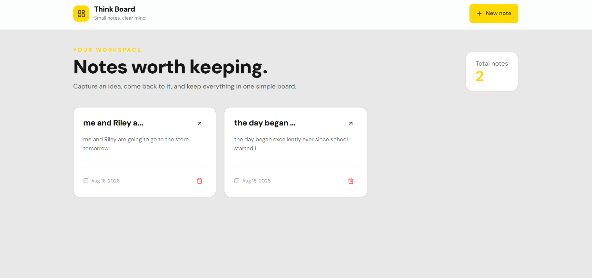
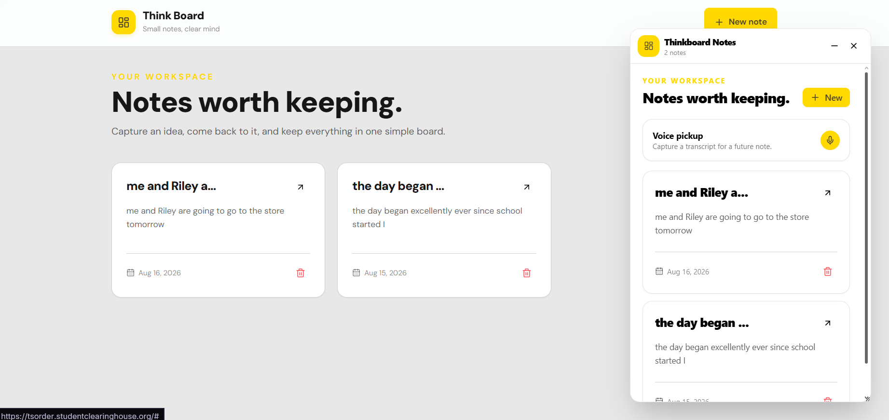
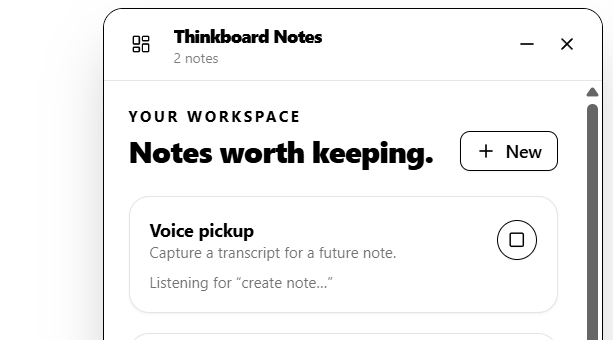
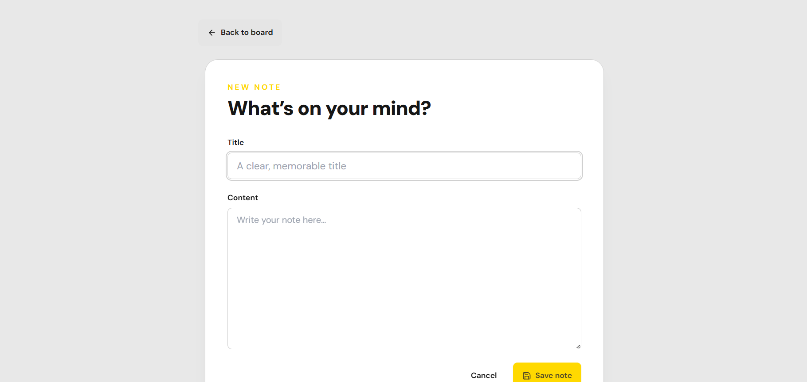
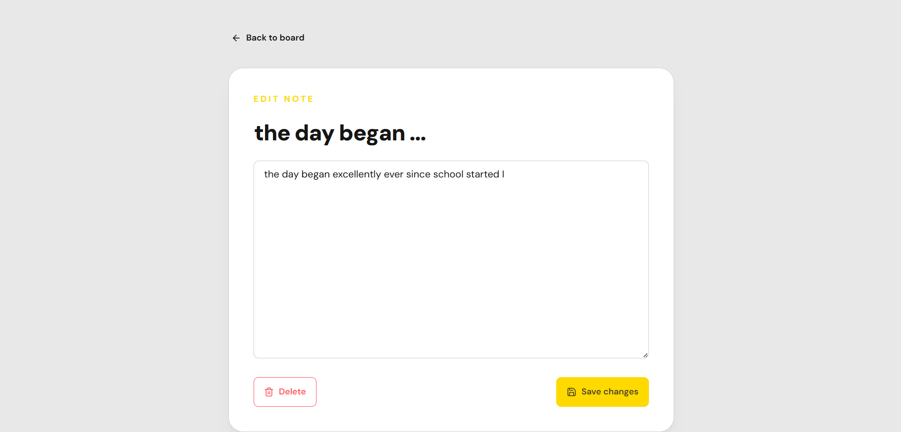

# Think Board

Think Board is a full-stack note taking application that keeps a browser workspace and a Chrome extension connected to the same set of notes. I built it to practice carrying a feature across a React interface, an Express API, and MongoDB rather than stopping at a standalone front end.

The web app supports creating, reading, updating, and deleting notes. The companion extension opens a draggable, resizable panel over the current webpage, so notes can be reviewed or changed without switching tabs. It also uses the browser Speech Recognition API to turn the phrase “create note…” and the words that follow it into a saved note.



## What I implemented

- A responsive React board with loading states, form validation, notifications, note counts, and newest first ordering
- REST endpoints for note creation, retrieval, updates, and deletion with Express and Mongoose
- Shared MongoDB data between the website and extension
- IP-based API rate limiting with Upstash Redis, including HTTP rate limit headers and a retry state in the UI
- A Manifest V3 Chrome extension that injects a React overlay through Shadow DOM to reduce style conflicts with the host page
- Extension controls for dragging, resizing, minimizing, creating, editing, and deleting notes
- Voice note capture through the Web Speech API, available from the panel or the `Alt+V` shortcut
- Environment-based API configuration for the web client and a Vite development proxy

### Notes without leaving the current page

The extension retrieves the same notes as the main board and provides the full note workflow inside an overlay. The panel is isolated with Shadow DOM and can be moved, resized, or minimized.



### Voice capture

Selecting the microphone or pressing `Alt+V` starts speech recognition. Saying “create note” followed by the note text saves the transcript through the same API used by the web application.



### Create and edit views

The dedicated forms validate required content, report request failures, and return the user to the board after a successful save.

| Create a note | Edit or delete a note |
| --- | --- |
|  |  |

## Built with

- React , React Router, Axios, and Vite
- Tailwind CSS, daisyUI, and Lucide icons
- Node.js, Express, and Mongoose
- MongoDB and Upstash Redis
- Chrome Extensions Manifest V3, Shadow DOM, and the Web Speech API

## Local setup

### Prerequisites

- Node.js and npm
- A MongoDB connection string
- An Upstash Redis database
- A Chromium-based browser to run the extension

### 1. Configure the API

Create `backend/.env`:

```env
PORT=5001
MONGO_URI=your_mongodb_connection_string
UPSTASH_REDIS_REST_URL=your_upstash_rest_url
UPSTASH_REDIS_REST_TOKEN=your_upstash_rest_token
```

Port `5001` is important for the current local setup because both the Vite proxy and extension point to it.

### 2. Install dependencies

Run the following from the repository root:

```bash
cd backend
npm install

cd ../frontend
npm install

cd ../extension
npm install
```

### 3. Start the API and web app

Use separate terminals:

```bash
cd backend
npm run dev
```

```bash
cd frontend
npm run dev
```

Open the local URL printed by Vite. During development, requests to `/api` are proxied to `http://localhost:5001`.

### 4. Build and load the extension

```bash
cd extension
npm run build
```

Then open `chrome://extensions`, enable **Developer mode**, select **Load unpacked**, and choose the generated `extension/dist` directory. Click the extension icon on a regular webpage to toggle the panel.

Voice capture depends on browser support for the Web Speech API and microphone permission. Chrome internal pages and the Chrome Web Store do not allow script injection, so the overlay will not open on those pages.

## API routes

| Method | Route | Purpose |
| --- | --- | --- |
| `GET` | `/api/notes` | Return all notes, newest first |
| `GET` | `/api/notes/:id` | Return one note |
| `POST` | `/api/notes` | Create a note |
| `PUT` | `/api/notes/:id` | Update a note |
| `DELETE` | `/api/notes/:id` | Delete a note |

## Skills demonstrated

This project was mad fun led by component based UI development, client-side routing, REST API design, asynchronous request handling, MongoDB data modeling, middleware, environment configuration, browser-extension development, and debugging across a three part JavaScript application. During this applications backend production I focused on applying rate limiting to build my understanding of necessary website restrictions along with making sure my API had the correct catch and HTTP status codes to ensure a professional development process.
